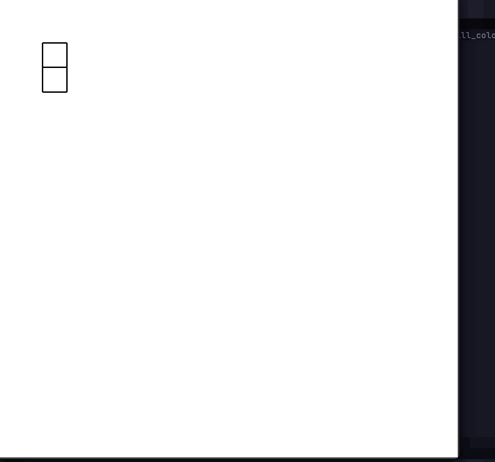

# Maze Generation and Solver 

## Overview
This Maze Generator and Solver was built using Python and Tkinter that generates mazes and solves them using search algorithms, DFS and BFS.
This GUI combines the Depth First Search algorithm and Breadth First Search algorithm for the maze generation and solving. 

## Features
- Maze Generation: Utilized a recursive DFS algorithm to generate unique mazes
- Maze Solving: Implemented BFS to find the shortest path from the start to the finished and visualized the shortest path.

## How to use
- clone the repo
- cd into the repo
- run python main.py
